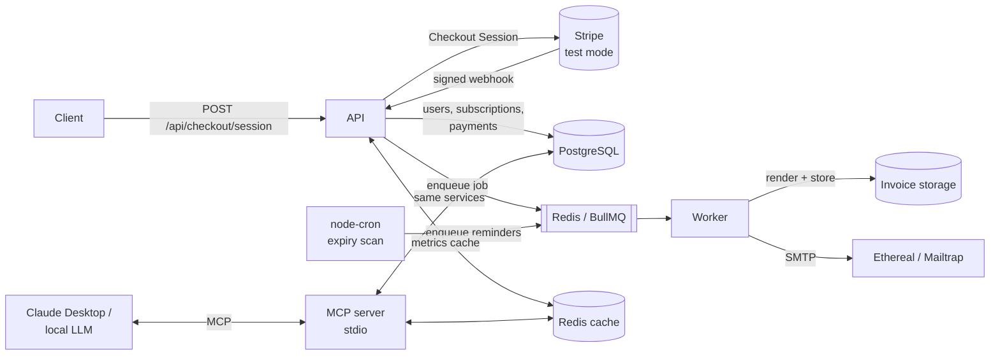

# AI-Enabled SaaS Subscription & Analytics Platform

Backend for a mini-SaaS that sells subscriptions through **Stripe (test mode)**, stores customers in **PostgreSQL**, generates **PDF/text invoices**, sends **confirmation and renewal emails** through a **Redis-backed job queue**, scans for expiring subscriptions with a **cron job**, caches metrics in **Redis**, and exposes live platform statistics to AI assistants via an **MCP server**.

Everything runs locally or on free tiers — total cost ₹0.

| Requirement | Where it lives |
|---|---|
| 1. Checkout + webhooks + PostgreSQL | [checkoutService.js](src/services/checkoutService.js), [stripeWebhookService.js](src/services/stripeWebhookService.js), [subscriptionService.js](src/services/subscriptionService.js), [001_init.sql](src/db/migrations/001_init.sql) |
| 2. Invoice + storage + email | [invoiceRenderer.js](src/services/invoiceRenderer.js), [invoiceService.js](src/services/invoiceService.js), [storage.js](src/lib/storage.js), [emailService.js](src/services/emailService.js) |
| 3. Cron + Redis queue + Redis cache | [expiryScanner.js](src/jobs/expiryScanner.js), [worker.js](src/worker.js), [queues/index.js](src/queues/index.js), [cache.js](src/lib/cache.js), [metricsService.js](src/services/metricsService.js) |
| 4. MCP server | [mcp/server.js](src/mcp/server.js) |

---

## Tech stack

Node.js 20+ (ES modules) · Express 5 · PostgreSQL 16 (`pg`) · Redis 7 (`ioredis`) · BullMQ · node-cron · Stripe SDK · Nodemailer (Ethereal / Mailtrap) · PDFKit · `@modelcontextprotocol/sdk` · Zod · Pino · Docker Compose

---

## Architecture



Three processes share one codebase:

| Process | Command | Responsibility |
|---|---|---|
| API | `npm run dev` | REST endpoints, Stripe webhooks, invoice downloads |
| Worker | `npm run worker:dev` | BullMQ consumer (invoice + emails) and the cron scheduler |
| MCP server | `npm run mcp` (started by the AI client) | Read-only analytics tools over stdio |

### Payment → invoice → email flow

1. `POST /api/checkout/session` creates a Stripe Checkout Session in `subscription` mode. The plan id is stored in the subscription's metadata.
2. The customer pays on Stripe's hosted page. The redirect back is informational only; **fulfillment happens only in the webhook**.
3. `POST /api/webhooks/stripe` verifies the signature against the raw body, then handles `checkout.session.completed`, `invoice.paid` (first payment and renewals), and `customer.subscription.updated/deleted`.
4. In **one transaction** it records the event id, upserts the user and subscription, and inserts the payment.
5. After commit, it enqueues a `payment-confirmation` job and invalidates the metrics cache.
6. The worker renders the invoice (PDF or text), saves it to storage, and emails the subscription details with a tokenised download link, plus the invoice as an attachment.

### Reliability decisions

- **Webhooks are processed exactly once.** Stripe delivers at least once. The event id goes into `webhook_events` in the same transaction as its side effects, so a crash rolls back both and Stripe's retry reprocesses cleanly. A redelivery after success returns `duplicate`.
- **The first payment isn't double-counted.** Stripe sends both `checkout.session.completed` and `invoice.paid` for the first charge. Both resolve to the Stripe invoice id, and `payments.external_ref` is `UNIQUE`, so whichever arrives first records the payment and the other is a no-op.
- **Jobs are idempotent.**
  - Deterministic BullMQ job ids (`payment-<id>`, `renewal-<sub>-<periodEnd>`) prevent duplicate enqueues.
  - Workers re-check state before acting: the invoice may already exist or be emailed, or the subscription may have renewed or been cancelled.
  - `renewal_reminders` has a `UNIQUE (subscription_id, period_end)` constraint.
- **Retries.** Jobs retry 5 times with exponential backoff.
- **Recovery sweeper.** If Redis is down when a webhook tries to enqueue, the payment is still committed, and the cron scan re-queues any payment without an emailed invoice.
- **One scan at a time.** The expiry scan takes a Redis lock (`SET NX EX` plus a compare-and-delete release), so multiple worker replicas never scan concurrently.
- **Caching never breaks a request.** The cache-aside helper falls back to PostgreSQL if Redis is down, and every payment or subscription change invalidates `metrics:*`.
- **Stripe API version compatibility.** Since API version `2025-03-31`, the billing period lives on subscription items and the invoice's subscription on `invoice.parent`. The webhook code reads both the new and old locations.

---

## Setup

### Prerequisites
- Node.js **20+**
- Docker Desktop, for PostgreSQL and Redis
- Optional: the [Stripe CLI](https://docs.stripe.com/stripe-cli) for real test-mode payments

### 1. Install and start infrastructure

```bash
git clone https://github.com/Gou-tham18/saas.git && cd saas
npm install
cp .env.example .env
docker compose up -d          # PostgreSQL :5432 and Redis :6379
npm run migrate
npm run seed                  # plans: starter ($9/mo), pro ($29/mo), business ($299/yr)
npm run seed -- --demo        # optional: 24 sample subscribers so metrics/MCP have data
```

### 2. Run the API and the worker (two terminals)

```bash
npm run dev          # API on http://localhost:3000
npm run worker:dev   # queue consumer + cron scheduler
```

`GET http://localhost:3000/health` should return `{"status":"ok", ...}`.

### 3. Free developer credentials

All of these are optional. Without Stripe keys the app runs with the simulated payment flow, and without SMTP settings it creates an Ethereal inbox automatically.

**Stripe test keys**
1. Create a free account at <https://dashboard.stripe.com/register> and switch to the **sandbox (Test mode)**.
2. Go to **Developers → API keys** (<https://dashboard.stripe.com/test/apikeys>) and copy the secret key (`sk_test_...`) into `STRIPE_SECRET_KEY`. The app refuses live keys.
3. Log the [Stripe CLI](https://docs.stripe.com/stripe-cli) in. When the browser asks you to choose an environment, pick the **sandbox**, not the live account:
   ```bash
   stripe login
   ```
4. Forward webhooks to your machine. Recent CLI versions require the event list:
   ```bash
   stripe listen --events checkout.session.completed,checkout.session.async_payment_succeeded,invoice.paid,customer.subscription.updated,customer.subscription.deleted --forward-to localhost:3000/api/webhooks/stripe
   ```
   Copy the printed `whsec_...` into `STRIPE_WEBHOOK_SECRET` and restart the API. Keep this terminal running while you test.

**Email (choose one)**
- **Ethereal (zero setup):** leave `SMTP_HOST` empty. A disposable inbox is created at startup, and each email logs a `previewUrl` you can open in the browser.
- **Mailtrap:** sign up at <https://mailtrap.io>, open **Email Testing → Inboxes → SMTP Settings**, and set `SMTP_HOST=sandbox.smtp.mailtrap.io`, `SMTP_PORT`, `SMTP_USER` and `SMTP_PASS`.

See [.env.example](.env.example) for every setting.

---

## Try it

### A. Real Stripe test-mode checkout

```bash
curl -X POST localhost:3000/api/checkout/session \
  -H "content-type: application/json" \
  -d '{"email":"you@example.com","name":"You","planCode":"pro"}'
```

1. Make sure `stripe listen` is running **before** you pay. Events that fire while it's stopped are not forwarded.
2. Open the returned `url` and pay with card `4242 4242 4242 4242`, any future expiry date and any CVC.
3. Watch the `stripe listen` terminal (each event should show `[200]`) and the worker log (invoice generated, email sent with `previewUrl`).

### B. Without Stripe (simulated payment, same pipeline)

```bash
curl -X POST localhost:3000/api/dev/simulate-payment \
  -H "content-type: application/json" \
  -d '{"email":"you@example.com","name":"You","planCode":"pro"}'
```

### C. Renewal reminders (cron + queue)

```bash
# A subscription that ends in 2 days (inside the 3-day reminder window)
curl -X POST localhost:3000/api/dev/simulate-payment -H "content-type: application/json" \
  -d '{"email":"soon@example.com","planCode":"starter","periodDays":2}'

# Run the scan now instead of waiting for the cron tick (or: npm run job:expiry)
curl -X POST localhost:3000/api/dev/run-expiry-scan
```

The worker sends the reminder. Running the scan again queues nothing, because reminders are deduplicated per billing period. For a live demo of the scheduler, set `EXPIRY_SCAN_CRON=*/1 * * * *`.

### D. Cached metrics

```bash
curl -i localhost:3000/api/admin/metrics/summary   # X-Cache: MISS
curl -i localhost:3000/api/admin/metrics/summary   # X-Cache: HIT (served from Redis)
```

---

## Verifying background jobs

The worker (`npm run worker:dev`) runs two kinds of Redis-queue jobs, plus the cron scan that creates reminder jobs:

| Job | Created by | Does |
|---|---|---|
| `payment-confirmation` | every successful payment (webhook or simulated) | generates + stores the invoice, sends the confirmation email |
| `renewal-reminder` | the cron expiry scan (`EXPIRY_SCAN_CRON`, hourly by default) | sends the renewal reminder email, once per billing period |

### 1. Trigger the jobs

```bash
# payment-confirmation job
curl -X POST localhost:3000/api/dev/simulate-payment -H "content-type: application/json" \
  -d '{"email":"jobs@example.com","name":"Jobs Check","planCode":"pro"}'

# renewal-reminder job: a subscription ending in 2 days, then run the cron scan now
curl -X POST localhost:3000/api/dev/simulate-payment -H "content-type: application/json" \
  -d '{"email":"jobs.renew@example.com","planCode":"starter","periodDays":2}'
curl -X POST localhost:3000/api/dev/run-expiry-scan
```

The scan responds with a summary, e.g. `{"days":3,"remindersQueued":1,"expired":0,"confirmationsRequeued":0}`. Running it a second time returns `"remindersQueued":0`, which shows reminders are not duplicated.

### 2. Check the worker log

Each finished job logs a `Job completed` line, and each email logs an `Email sent` line with a `previewUrl`:

```
"job":"payment-confirmation","result":{"invoice":"INV-2026-000001","previewUrl":"https://ethereal.email/message/..."}
"subject":"Your Starter subscription renews on ...","previewUrl":"https://ethereal.email/message/...","msg":"Email sent"
```

Open the `previewUrl` in a browser to see the email: subscription details, the attached invoice PDF and the download link. With Mailtrap configured, the emails appear in your Mailtrap inbox instead.

### 3. Check the results in PostgreSQL

```bash
docker exec -it saas-postgres psql -U saas -d saas
```

```sql
-- confirmation emails: emailed_at is set once the email was sent
SELECT u.email, i.invoice_number, i.storage_key, i.emailed_at
FROM invoices i JOIN users u ON u.id = i.user_id ORDER BY i.id DESC LIMIT 5;

-- renewal reminders: one row per subscription per billing period
SELECT u.email, r.period_end, r.sent_at
FROM renewal_reminders r
JOIN subscriptions s ON s.id = r.subscription_id
JOIN users u ON u.id = s.user_id ORDER BY r.sent_at DESC LIMIT 5;
```

The invoice files are stored under `storage/invoices/<year>/<month>/`.

### 4. Inspect the Redis queue (optional)

```bash
docker exec -it saas-redis redis-cli
KEYS bull:notifications:*             # queue keys
ZRANGE bull:notifications:completed 0 -1   # ids of completed jobs, e.g. payment-42, renewal-7-1790...
ZRANGE bull:notifications:failed 0 -1      # failed jobs (should be empty)
```

Jobs retry up to 5 times with exponential backoff. If the worker is stopped, jobs wait in Redis and are processed when it starts again. The hourly scan also re-queues any payment whose confirmation email was never sent.

---

## API reference

| Method | Path | Description |
|---|---|---|
| GET | `/health` | PostgreSQL, Redis and Stripe status |
| GET | `/api/plans` | Active plans |
| POST | `/api/checkout/session` | `{ email, name?, planCode }` → `{ sessionId, url }` |
| GET | `/api/checkout/success`, `/api/checkout/cancel` | Checkout redirect targets |
| POST | `/api/webhooks/stripe` | Stripe webhook receiver (signature-verified) |
| GET | `/api/invoices/:invoiceNumber/download?token=` | Invoice download (link from the email) |
| GET | `/api/admin/metrics/summary` | Cached KPIs: subscribers, revenue, MRR/ARR, plan mix |
| GET | `/api/admin/metrics/revenue?days=30` | Cached daily revenue series |
| GET | `/api/admin/subscriptions/expiring?days=7` | Subscriptions ending soon |
| GET | `/api/admin/users/:email` | A customer's profile, subscriptions and invoices |
| POST | `/api/dev/simulate-payment` | `{ email, name?, planCode, periodDays? }`, dev only |
| POST | `/api/dev/run-expiry-scan` | `{ days? }` runs the cron job now, dev only |

When `ADMIN_API_KEY` is set, `/api/admin/*` requires an `x-api-key` header. `/api/dev/*` is mounted only when `ENABLE_DEV_ROUTES=true`, and the app refuses to start with it enabled in production.

---

## MCP server (AI agent interface)

[src/mcp/server.js](src/mcp/server.js) is a stdio MCP server that reuses the backend's services. The AI sees the same PostgreSQL data and Redis metrics cache as the REST API. All tools are read-only.

| Tool | Returns |
|---|---|
| `get_active_subscribers` | Total active subscribers and subscriptions, per-plan breakdown |
| `get_revenue_totals` | Simulated revenue: all-time, last 30 days, month-to-date, MRR, ARR |
| `get_platform_summary` | Full KPI snapshot, including churn risk (expiring or pending cancellation) |
| `get_revenue_by_day` | `{ days }` daily revenue series |
| `list_expiring_subscriptions` | `{ days, limit }` subscriptions ending soon |
| `lookup_customer` | `{ email }` profile, subscriptions and invoices |

### Connect Claude Desktop

Edit `claude_desktop_config.json`:
- **Windows:** `%APPDATA%\Claude\claude_desktop_config.json`
- **macOS:** `~/Library/Application Support/Claude/claude_desktop_config.json`

Add the server, using the absolute path to your clone:

```json
{
  "mcpServers": {
    "saas-analytics": {
      "command": "node",
      "args": ["C:/path/to/saas/src/mcp/server.js"]
    }
  }
}
```

Restart Claude Desktop, then ask, for example:
- *"How many active subscribers do we have?"*
- *"What's our simulated MRR and revenue this month?"*
- *"Which subscriptions expire in the next 3 days?"*

The server loads `.env` from the project root, regardless of the directory the client launches it from. It logs only to stderr, so stdout stays clean for JSON-RPC.

To inspect the server without Claude: `npx @modelcontextprotocol/inspector node src/mcp/server.js`

---

## Data model

```
users ─┬─< subscriptions >── plans
       ├─< payments ──── invoices (1:1 with payment)
       └── (subscriptions) ─< renewal_reminders
webhook_events        (Stripe event ids, for idempotency)
schema_migrations     (applied migration files)
```

Money is stored as integer cents. Emails are unique case-insensitively (`lower(email)` index). A partial index on `subscriptions(current_period_end) WHERE status IN ('active','trialing')` serves the expiry scan.

---

## Testing

```bash
npm test                   # unit tests, no infrastructure needed
npm run test:integration   # needs `docker compose up -d`, no Stripe account needed
```

The integration suite runs the real webhook route against a fake Stripe API, using webhooks signed with a test secret. It covers:
- signature rejection
- first payment through `checkout.session.completed`
- `invoice.paid` for the same invoice not creating a second payment
- duplicate event redelivery
- subscription state sync
- renewals
- ignored event types

---

## Troubleshooting

| Problem | Fix |
|---|---|
| `stripe listen` says *"must specify events to forward using --events..."* | Recent CLI versions need an event list. Use the full command from [Free developer credentials](#3-free-developer-credentials). |
| Paid, but nothing appears in `stripe listen` and no subscription is created | `stripe listen` must be running **before** you pay. Check that `stripe login` used the same sandbox your `sk_test_` key belongs to, restart `stripe listen`, and pay again with a new checkout session. |
| Webhook returns `400 Webhook signature verification failed` | `STRIPE_WEBHOOK_SECRET` doesn't match the secret `stripe listen` printed. Update `.env` and restart the API. |
| `/health` shows `stripe: not configured` | `STRIPE_SECRET_KEY` is empty or `.env` wasn't saved. Restart the API after editing `.env`. |
| Windows: `wsl --install` fails with *"A connection with the server could not be established"* | Run `wsl --install --web-download` in an Administrator PowerShell, or try another network. |
| Docker Desktop stays on *"Engine starting"* | The first start can take a few minutes. If it hangs, quit Docker Desktop, run `wsl --shutdown`, and start it again. Check that virtualization is enabled (Task Manager → Performance → CPU). |
| `docker compose up` fails with *"port is already allocated"* | Another PostgreSQL or Redis is using port 5432 or 6379. Stop it, or change the host port in `docker-compose.yml` and in `DATABASE_URL` / `REDIS_URL`. |

---

## Project structure

```
src/
  app.js, server.js        Express app + API entrypoint
  worker.js                BullMQ worker + node-cron scheduler
  config/env.js            Zod-validated environment config
  db/                      pool, migration runner, SQL migrations, seed
  lib/                     redis, cache, stripe, mailer, storage, logger, helpers
  routes/                  URL -> controller mapping (checkout, webhooks, invoices, admin, dev)
  controllers/             HTTP layer: validate input, call services, shape the response
  services/                business logic: checkout, webhooks, subscriptions, payments, invoices, email, metrics
  models/                  data access: all SQL, one model per table (+ reporting queries)
  middleware/              validation helper, admin API key, request logging, error handling
  queues/                  queue + job definitions
  workers/                 job processors
  jobs/                    expiry scanner (cron) + manual runner
  mcp/server.js            MCP server
test/                      unit + integration tests
storage/invoices/          generated invoices (git-ignored)
```

A request flows **route → controller → service → model → PostgreSQL** (services also talk to Redis and Stripe). Controllers never contain business logic, services never touch `req`/`res` or write SQL, and models contain only SQL, so the same services and models are reused by the worker, the cron job and the MCP server.

---

## Trade-offs and next steps

- **Storage:** invoices go to local disk behind a small `save/read/exists` interface. Moving to a free S3-compatible bucket (Cloudflare R2, Supabase Storage) means swapping one class.
- **Auth:** there is no end-user auth. It's out of scope for the brief, so admin endpoints use an optional API key. Production would add JWT or session auth and a customer portal (Stripe Billing Portal).
- **Scaling:** the API and the worker scale horizontally. Queue job ids and the scan lock make duplicate work harmless.
- **Observability:** logs are structured JSON (Pino). Next would be BullMQ metrics or Bull Board and request tracing.
